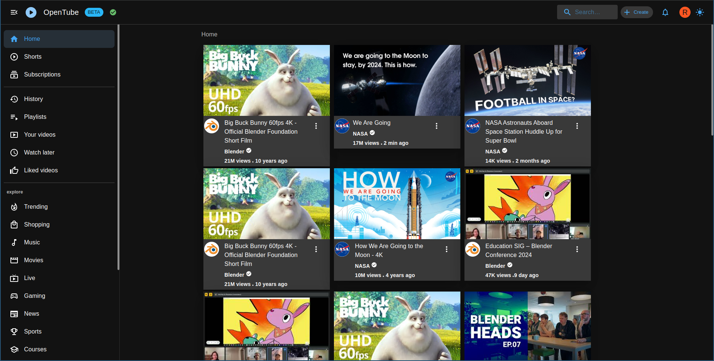
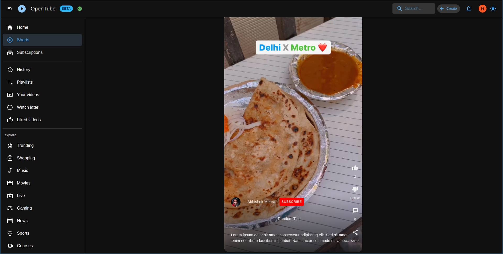
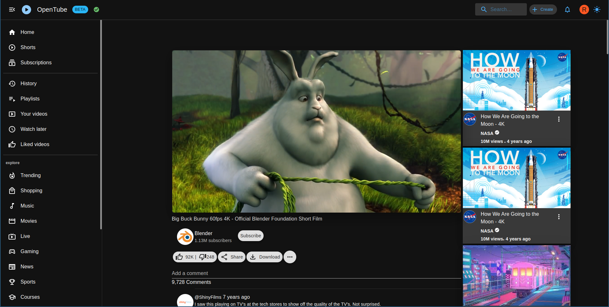
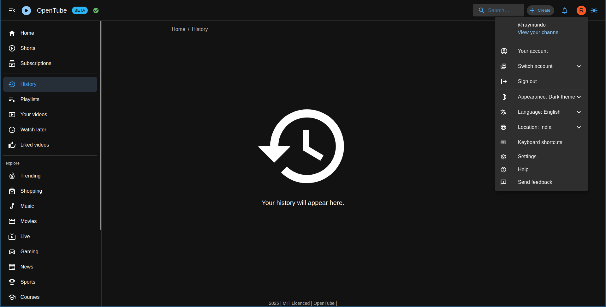

<h1 align="left">

OpenTube
</h1>

# Decentralized Platform
As a free and open-source, ActivityPub federated platform, OpenTube empowers users with control and data ownership. It stands in stark contrast to centralized platforms like YouTube, where users are subject to algorithms and data collection practices. This decentralized nature encourages community ownership and fosters a more open and democratic online video ecosystem.

<h2 align="left">

Screenshots
</h2>

<h2 align="left">

Features
</h2>

| Feature           |    Description |
| ----------------- | --- |
| Decentralized Platform |	Fosters community ownership and avoids data collection practices of centralized platforms like YouTube. |
| ActivityPub Federation |	Connects to other ActivityPub platforms, expanding content reach and fostering interoperability. |
| Free and Open-Source | Transparent codebase allows for community contributions and fosters trust. |
| User Control |	Users own their data and content, unlike on centralized platforms. |
| Privacy-Focused |	Minimizes data collection and avoids targeted advertising. |
| Customization |	Users can personalize their experience with themes and settings. |
| Community-Driven |	Development relies on community contributions, promoting collaboration and ownership. |
| Accessible |	Open-source nature allows for contributions to improve accessibility for diverse users. |
| Future-Oriented |	Contributes to the development of a more open and democratic video ecosystem. |

<h2 align="left">

Contributing
</h2>

## Code Contributions
If you're a developer, dive into the open-source codebase on GitHub and help improve the platform's core functionality, user interface, or integration with other decentralized services.

## Content Creation
Upload and share your videos directly on OpenTube, promoting diverse content and contributing to the platform's growth.

## Translation & Localization: 
Help make OpenTube accessible to a wider audience by translating its interface and documentation into new languages.
Spreading the Word: Raise awareness about OpenTube in your online communities and networks, encouraging others to explore and contribute to this alternative video platform.

## Testing & Feedback
Become a tester and provide valuable feedback on new features and bug fixes, helping to shape the future of OpenTube.

Remember, every contribution, big or small, helps build a stronger and more vibrant decentralized video ecosystem. So, choose your way to participate and become part of the movement towards open and ethical video sharing!

<h2 align="left">

Privacy Policy 
</h2>

At OpenTube, we are committed to protecting your privacy and ensuring the security of your personal information. When you use our platform, we may collect certain data to enhance your user experience, but rest assured, we prioritize the confidentiality and responsible use of your information.

1. Data Collection:
We collect minimal data required for the functionality of OpenTube. This may include user preferences, session information, and non-personalized usage statistics. We do not store personally identifiable information unless explicitly provided by users for specific features.

2. Usage of Information:
The collected data is used solely for improving OpenTube's performance, enhancing user experience, and maintaining the platform's integrity. We do not share or sell any personal information with third parties.

3. Cookies and Tracking:
OpenTube may use cookies and similar technologies to enhance your browsing experience. These tools help us analyze usage patterns and improve our services. You can adjust your browser settings to manage or disable cookies, though this may affect certain features of the platform.

4. Third-Party Services:
OpenTube may integrate with third-party services such as Invidious and Piped. Users are encouraged to review the privacy policies of these services independently, as they operate under their respective terms.

<h2 align="left">

Disclaimer
</h2>

1. Content Accuracy:
OpenTube strives to provide accurate and up-to-date information, but we do not guarantee the accuracy, completeness, or timeliness of the content. Users should independently verify information before relying on it.

2. Third-Party Links:
OpenTube may contain links to third-party websites for additional content or resources. We are not responsible for the content, privacy policies, or practices of these external sites and encourage users to review their policies independently.

3. Platform Availability:
While we make every effort to ensure uninterrupted access to OpenTube, we cannot guarantee the platform's availability at all times. Maintenance, updates, and unforeseen issues may temporarily impact access.

4. Use of OpenTube:
Users are expected to use OpenTube in compliance with applicable laws and regulations. We disclaim any liability for the misuse of the platform or any consequences arising from such misuse.

5. Changes to Policies:
OpenTube reserves the right to update and modify the Privacy Policy and Disclaimer. Users are encouraged to periodically review these policies for any changes.

By using OpenTube, you agree to the terms outlined in the Privacy Policy and Disclaimer. If you have any questions or concerns, please contact us at [Matrix](https://matrix.to/#/#opensourceprojects:matrix.org).

## License

This project is licensed under the terms of the [MIT license](/LICENSE).

## Support the Future of Open Video: Donate to OpenTube!
OpenTube stands at the forefront of a decentralized video revolution, empowering users with control and fostering an open ecosystem. But building and maintaining this alternative platform requires ongoing support. Your donation, no matter how big or small, fuels the development, improves features, and expands reach. By donating to OpenTube, you're not just giving money, you're investing in a future where video sharing is open, transparent, and user-driven. Become part of the movement and contribute to a thriving decentralized video landscape. Donate to OpenTube today!

